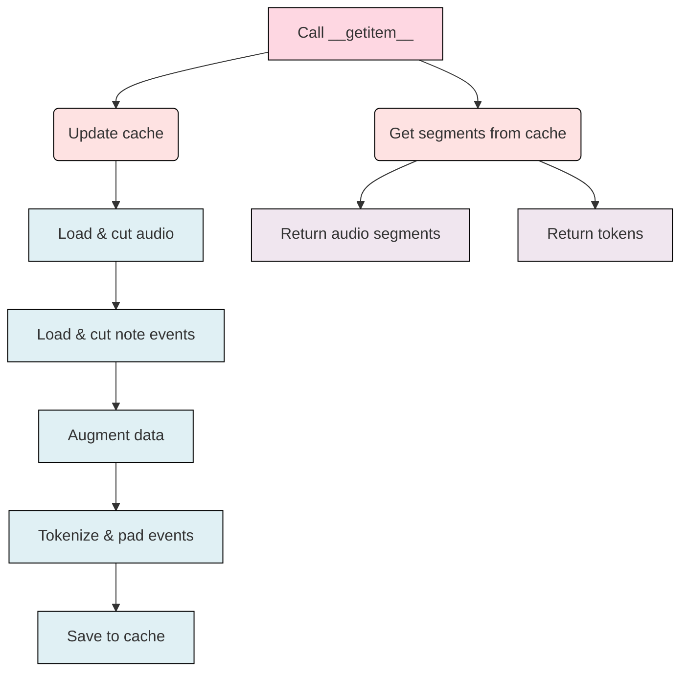

# YourMT3: Utils

## CachedAudioDataset

```mermaid
graph TB
    A[Call __getitem__]:::main --> B1(Update cache):::process
    A --> B2(Get segments from cache):::process
    B1 --> C1[Load & cut audio]:::subprocess
    C1 --> C2[Load & cut note events]:::subprocess
    C2 --> C3[Augment data]:::subprocess
    C3 --> C4[Tokenize & pad events]:::subprocess
    C4 --> C5[Save to cache]:::subprocess
    B2 --> D1[Return audio segments]:::output
    B2 --> D2[Return tokens]:::output

    classDef main fill:#FED7E2,stroke:#000000;
    classDef process fill:#FEE2E2,stroke:#000000;
    classDef subprocess fill:#E0F0F4,stroke:#000000;
    classDef output fill:#F0E6EF,stroke:#000000;
```
